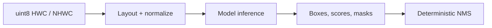

# FastVisionOps

[](https://github.com/Som5ra/FastVisionOps/actions/workflows/ci.yml)
[](https://www.python.org/)
[](https://numpy.org/)

**A compact, validated CPU toolkit for the preprocessing and postprocessing
stages of vision inference.**

FastVisionOps combines the former FastPreProcess and NMSs projects behind one
Python package and one rebuildable native library. It handles uint8 image
layout conversion and normalization, bounding-box NMS, boolean-mask NMS,
multiclass suppression, and batched execution without requiring a
deep-learning framework.

## Why FastVisionOps

- **One inference utility layer:** preprocessing and NMS share one install,
  validation policy, test suite, native build, and benchmark workflow.
- **Measured acceleration:** the fused native preprocessor completed a
  427×640 image in **0.249 ms** versus **4.492 ms** for NumPy on the evaluation
  host.
- **Correct before fast:** every benchmark checks native output against the
  NumPy reference before accepting a timing.
- **Defensive inputs:** dtype, dimensionality, channel statistics, coordinates,
  thresholds, and empty inputs are validated with actionable errors.
- **Deterministic NMS:** equal scores are resolved by original input index.
- **Reproducible native code:** the repository ships portable C source, not an
  opaque ABI-specific binary.



## Installation

Install the NumPy implementation:

```bash
python -m pip install .
```

Compile the optional native backend:

```bash
python -m fastvisionops.build
```

The build requires GCC or Clang. OpenMP is enabled when supported and the
builder automatically falls back to portable single-threaded C. Use `CC` or
`--compiler` to choose a compiler; use `--no-openmp` for an explicit portable
build.

## Quick start

### Image preprocessing

```python
import numpy as np

from fastvisionops import hwc_to_chw_normalize

image = np.zeros((427, 640, 3), dtype=np.uint8)
mean = [123.675, 116.28, 103.53]
std = [58.395, 57.12, 57.375]

tensor = hwc_to_chw_normalize(
    image,
    mean,
    std,
    flip_rb=True,
)
# float32, shape (3, 427, 640), C-contiguous
```

For the accelerated path:

```python
from fastvisionops import NativeBackend

backend = NativeBackend()
tensor = backend.hwc_to_chw_normalize(
    image,
    mean,
    std,
    flip_rb=True,
    threads=8,
)
```

Both single-image HWC and batched NHWC inputs are supported. `flip_rb=True`
normalizes using the source-channel statistics and reverses the three output
channels. Noncontiguous inputs are handled correctly.

### Bounding-box NMS

```python
from fastvisionops import nms

boxes = np.array(
    [
        [0.0, 0.0, 10.0, 10.0],
        [1.0, 1.0, 9.0, 9.0],
        [20.0, 20.0, 30.0, 30.0],
    ]
)
scores = np.array([0.90, 0.80, 0.70])

keep = nms(
    boxes,
    scores,
    score_threshold=0.50,
    iou_threshold=0.50,
)
# array([0, 2])
```

Use `NativeBackend.nms` for native execution. `multiclass_nms` supports both
class-aware and class-unaware suppression and returns globally score-ordered
box and class indices.

### Boolean-mask NMS

```python
from fastvisionops import mask_nms

masks = np.zeros((3, 64, 64), dtype=bool)
masks[0, :20, :20] = True
masks[1, 2:18, 2:18] = True
masks[2, 40:, 40:] = True

keep = mask_nms(masks, scores, iou_threshold=0.50)
# array([0, 2])
```

Masks must use boolean dtype and share the same spatial shape.

## Performance

The benchmark includes public API validation, allocation, and array
preparation. It performs two warm-ups and reports the median of nine measured
wall-clock runs.

### Fused image preprocessing

Image shape: 427×640×3, 8 native threads.

| Batch | NumPy (ms) | Native (ms) | Speedup |
| ---: | ---: | ---: | ---: |
| 1 | 4.492 | 0.249 | **18.07x** |
| 8 | 26.263 | 1.888 | **13.91x** |
| 32 | 139.105 | 9.758 | **14.25x** |

### Bounding-box NMS

| Boxes | Kept | NumPy (ms) | Native (ms) | Speedup |
| ---: | ---: | ---: | ---: | ---: |
| 250 | 178 | 4.798 | 0.272 | **17.66x** |
| 1,000 | 607 | 23.257 | 3.340 | **6.96x** |
| 2,500 | 1,284 | 75.396 | 17.121 | **4.40x** |

Recorded on Linux x86_64 with Python 3.12.13, NumPy 2.3.5, GCC 13.3, and
9 available Intel Xeon Platinum 8573C vCPUs. Results vary with hardware,
compiler, input distribution, suppression rate, and system load.

Reproduce the measurements:

```bash
python -m benchmarks.benchmark_preprocess
python -m benchmarks.benchmark_bbox
```

Add `--format json` for machine-readable output. See the
[evaluation report](docs/evaluation.md) for methodology, environment, test
evidence, and limitations.

## Correctness and validation

Run the complete suite:

```bash
python -m fastvisionops.build
python -m unittest discover -s tests -v
```

The 37 tests cover:

- exact and randomized preprocessing equivalence;
- RGB/BGR reversal, batches, empty batches, and noncontiguous images;
- bbox and mask IoU behavior;
- class-aware and class-unaware suppression;
- thresholds, coordinate offsets, stable ties, and empty detections;
- malformed input rejection;
- randomized NumPy/native NMS equivalence; and
- serial/concurrent batch equivalence.

CI runs the suite and benchmark smoke tests on Python 3.9, 3.12, and 3.13.

## API map

| API | Purpose | Backend |
| --- | --- | --- |
| `hwc_to_chw` | HWC → CHW layout conversion | NumPy |
| `chw_channel_normalize` | Per-channel CHW normalization | NumPy |
| `hwc_to_chw_normalize` | Fused HWC → normalized CHW | NumPy |
| `hwc_to_chw_normalize_batched` | Fused NHWC → normalized NCHW | NumPy |
| `NativeBackend.hwc_to_chw_normalize` | Fused single-image preprocessing | C / OpenMP |
| `NativeBackend.hwc_to_chw_normalize_batched` | Fused batch preprocessing | C / OpenMP |
| `nms` | Single-class bbox NMS | NumPy |
| `multiclass_nms` | Aware or unaware bbox NMS | NumPy |
| `mask_nms` / `multiclass_mask_nms` | Boolean-mask NMS | NumPy |
| `NativeBackend.nms` / `multiclass_nms` | Bounding-box NMS | C |
| `NativeBackend.batch_multiclass_nms` | Concurrent image batches | C |

Standalone transpose and normalization remain NumPy operations because the
fused path is the useful native hot path and avoids unnecessary intermediate
arrays.

## Migration

New integrations should import from `fastvisionops`.

| Previous project | Previous API | FastVisionOps API |
| --- | --- | --- |
| FastPreProcess | `fastpreprocess.hwc_to_chw_normalize` | `fastvisionops.hwc_to_chw_normalize` |
| FastPreProcess | `fastpreprocess.hwc_to_chw_normalize_batched` | `fastvisionops.hwc_to_chw_normalize_batched` |
| FastPreProcess | compiled fused functions | `fastvisionops.NativeBackend` methods |
| NMSs | `nmss.nms` and related imports | `fastvisionops.nms` and related imports |
| NMSs | `nmss.c_backend.CBackend` | `fastvisionops.NativeBackend` |

The `nmss` package remains as a backward-compatible namespace and points to the
same maintained implementation. The old unsafe FastPreProcess binary is not
shipped; the replacement validates inputs, owns memory through NumPy, supports
noncontiguous arrays, and removes the unused OpenCV and pybind11 dependencies.

## Repository layout

```text
fastvisionops/          Primary package, native bindings, and C source
nmss/                   Backward-compatible NMS namespace
tests/                  Correctness and native-equivalence suite
benchmarks/             Reproducible elapsed-time benchmarks
docs/evaluation.md      Methodology, evidence, and limitations
bbox-nms*/ mask-nms/    Legacy import adapters
.github/workflows/      Python-version CI matrix
```

## Scope

FastVisionOps targets deterministic CPU inference utilities. GPU kernels,
resize/color conversion, Soft-NMS, DIoU-NMS, native mask kernels, and prebuilt
platform wheels are outside the current release.
