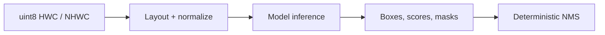

# FastVisionOps

[](https://github.com/Som5ra/FastVisionOps/actions/workflows/ci.yml)
[](https://www.python.org/)
[](https://numpy.org/)

**Validated, framework-independent CPU operations for vision inference.**

FastVisionOps combines the former FastPreProcess and NMSs projects behind one
Python package and one rebuildable native library. It covers image layout
conversion and normalization, bounding-box NMS, boolean-mask NMS, multiclass
suppression, and batched execution.

- **Unified:** one install, validation policy, native build, and test suite.
- **Measured:** benchmarks report absolute latency and speedup after checking
  native output against NumPy.
- **Defensive:** malformed images, statistics, boxes, scores, and controls fail
  early with actionable errors.
- **Reproducible:** portable C source replaces opaque platform binaries and
  falls back cleanly when OpenMP is unavailable.



## Install

```bash
python -m pip install .
python -m fastvisionops.build
```

The NumPy APIs work immediately after installation. The second command builds
the optional native backend with GCC or Clang. It uses OpenMP when supported
and otherwise retries as portable single-threaded C. Use `CC`, `--compiler`,
or `--no-openmp` to control the build.

## Quick start

### Preprocess images

```python
import numpy as np

from fastvisionops import NativeBackend, hwc_to_chw_normalize

image = np.zeros((427, 640, 3), dtype=np.uint8)
mean = [123.675, 116.28, 103.53]
std = [58.395, 57.12, 57.375]

# NumPy reference: float32 CHW, shape (3, 427, 640)
tensor = hwc_to_chw_normalize(image, mean, std, flip_rb=True)

# Native fused path
backend = NativeBackend()
fast_tensor = backend.hwc_to_chw_normalize(
    image,
    mean,
    std,
    flip_rb=True,
    threads=8,
)
np.testing.assert_allclose(fast_tensor, tensor, rtol=1e-6, atol=1e-6)
```

Single-image HWC and batched NHWC inputs are supported. Outputs are contiguous
CHW or NCHW arrays. Noncontiguous inputs are handled correctly.

### Suppress detections

```python
from fastvisionops import nms

boxes = np.array(
    [
        [0.0, 0.0, 10.0, 10.0],
        [1.0, 1.0, 9.0, 9.0],
        [20.0, 20.0, 30.0, 30.0],
    ]
)
scores = np.array([0.90, 0.80, 0.70])

keep = nms(
    boxes,
    scores,
    score_threshold=0.50,
    iou_threshold=0.50,
)
# array([0, 2])
```

Use `NativeBackend.nms` for native bbox execution. `multiclass_nms` supports
class-aware and class-unaware suppression. `mask_nms` and
`multiclass_mask_nms` operate on boolean masks.

## Measured performance

Each row reports the median duration of one complete public API call after two
warm-ups and nine measured runs. Validation and allocation are included.

| Workload | Baseline | Optimized | Speedup |
| --- | ---: | ---: | ---: |
| Preprocess 1 × 427×640×3 | NumPy 4.492 ms | Native 0.249 ms | **18.07x** |
| Preprocess 32 × 427×640×3 | NumPy 139.105 ms | Native 9.758 ms | **14.25x** |
| NMS, 250 boxes | NumPy 4.798 ms | Native 0.272 ms | **17.66x** |
| NMS, 2,500 boxes | NumPy 75.396 ms | Native 17.121 ms | **4.40x** |
| 8 images × 1,000 boxes | Serial C 27.595 ms | Parallel C 9.995 ms | **2.76x** |

Recorded on Linux x86_64 with Python 3.12.13, NumPy 2.3.5, GCC 13.3, and
9 available Intel Xeon Platinum 8573C vCPUs. Reproduce the measurements:

```bash
python -m benchmarks.benchmark_preprocess
python -m benchmarks.benchmark_bbox
```

Add `--format json` for machine-readable output. The
[evaluation report](docs/evaluation.md) documents the complete methodology,
environment, results, and limitations.

## API

| API | Purpose | Backend |
| --- | --- | --- |
| `hwc_to_chw` | HWC → CHW layout conversion | NumPy |
| `chw_channel_normalize` | Per-channel CHW normalization | NumPy |
| `hwc_to_chw_normalize` | Fused HWC → normalized CHW | NumPy |
| `hwc_to_chw_normalize_batched` | Fused NHWC → normalized NCHW | NumPy |
| `NativeBackend.hwc_to_chw_normalize*` | Fused single/batch preprocessing | C / OpenMP |
| `nms` / `multiclass_nms` | Bounding-box NMS | NumPy |
| `mask_nms` / `multiclass_mask_nms` | Boolean-mask NMS | NumPy |
| `NativeBackend.nms` / `multiclass_nms` | Bounding-box NMS | C |
| `NativeBackend.batch_multiclass_nms` | Concurrent image batches | C |

Standalone transpose and normalization remain NumPy operations; the fused
native path avoids intermediate arrays and accelerates the useful hot path.

## Validation

```bash
python -m fastvisionops.build
python -m unittest discover -s tests -v
```

The 41 tests cover exact and randomized NumPy/native equivalence, empty and
noncontiguous inputs, channel reversal, deterministic ties, multiclass
behavior, malformed controls, portable builds, and serial/concurrent batches.
CI runs the suite and benchmark smoke tests on Python 3.9, 3.12, and 3.13.

## Migration

New integrations should import from `fastvisionops`.

| Previous API | FastVisionOps API |
| --- | --- |
| `fastpreprocess.hwc_to_chw_normalize` | `fastvisionops.hwc_to_chw_normalize` |
| `fastpreprocess.hwc_to_chw_normalize_batched` | `fastvisionops.hwc_to_chw_normalize_batched` |
| FastPreProcess compiled functions | `fastvisionops.NativeBackend` methods |
| `nmss.nms` and related imports | `fastvisionops.nms` and related imports |
| `nmss.c_backend.CBackend` | `fastvisionops.NativeBackend` |

The `nmss` namespace remains backward compatible and points to the maintained
implementation. The unsafe FastPreProcess binary is not shipped; its
replacement validates inputs, uses NumPy-owned memory, supports noncontiguous
arrays, and removes the unused OpenCV and pybind11 dependencies.

FastVisionOps currently targets deterministic CPU utilities. GPU kernels,
resize/color conversion, Soft-NMS, DIoU-NMS, native mask kernels, and prebuilt
wheels remain outside this release.
